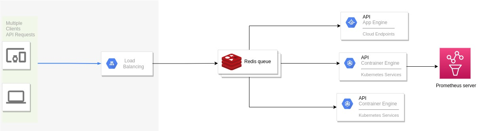

# dog_monitor

#### Metering & Data Collection Service
DogMonitor's goal is to efficiently collect, normalize and transform data produced by prometheus services.





## how to use This Service

#### step 1

```
vim api/config.py

add prometheus address in this Config.py


PROMETHEUS = 'http://ip:9090/'
```

#### step 2

```
vim utils/openstack/config.py

add external ip in this config for connection openstack services

user_name = ""
password = ""
url= "external ip"
project_scope_name = ""
domain_id = ""
```

#### step 3

``` 
run service 

python3 main.py 

```

